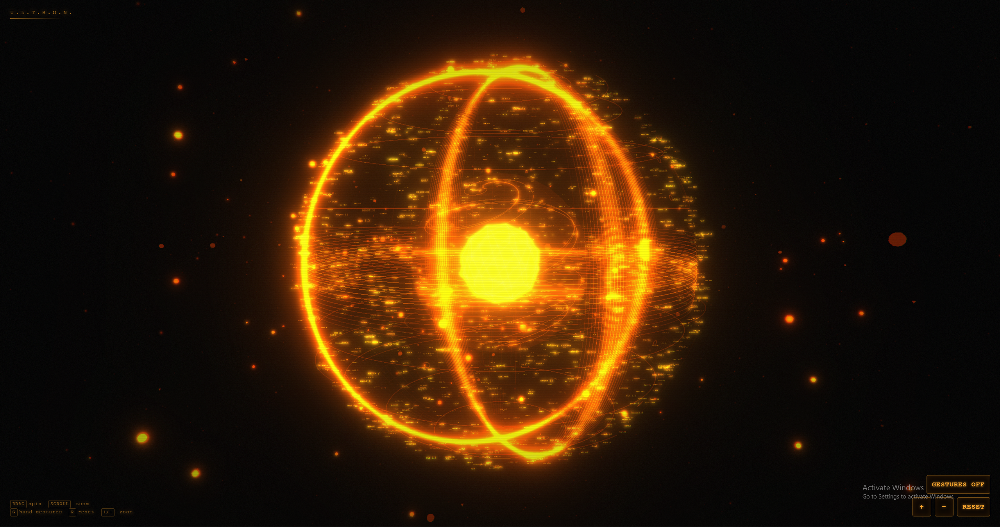

# ULTRON Orb UI

An Iron Man–inspired holographic orb built with **Next.js**, **Three.js**, and **MediaPipe** hand tracking — control it with your bare hands through your webcam.

> 🔮 A holographic AI assistant interface — wake-word locked, hand-gesture
> controlled, with a streaming Gemini/Groq brain, Fish Audio voice, and an
> optional LiveKit server-side voice agent. Built to run on modest hardware.



https://github.com/user-attachments/assets/91578a83-9a27-44e8-84b0-96defcfd7366

## Getting started

```bash
npm install
npm run dev
```

Open [http://localhost:3000](http://localhost:3000).

## Setup & API keys

The app works with **zero keys** — the orb, lock screen, wake word, claps,
and browser-voice answers all function out of the box. API keys upgrade the
brain and the voice:

| Key | What it unlocks | Get it from |
| --- | --- | --- |
| `GEMINI_API_KEY` | Primary LLM (Gemini flash) | [aistudio.google.com/apikey](https://aistudio.google.com/apikey) |
| `GROQ_API_KEY` | Fallback LLM (extremely fast) | [console.groq.com/keys](https://console.groq.com/keys) |
| `OPENROUTER_API_KEY` | Last-resort LLM fallback | [openrouter.ai/keys](https://openrouter.ai/keys) |
| `FISH_AUDIO_API_KEY` | Premium TTS voice (falls back to browser voice) | [fish.audio](https://fish.audio) |
| `FISH_AUDIO_VOICE_ID` | Choose a specific Fish Audio voice | fish.audio → voices |
| `LIVEKIT_URL` + `LIVEKIT_API_KEY` + `LIVEKIT_API_SECRET` | LIVE server-side voice agent | [cloud.livekit.io](https://cloud.livekit.io) (free tier) |

**Where keys go:**

```bash
cp .env.local.example .env.local   # then paste your keys into .env.local
```

- **`.env.local`** holds real keys — it is git-ignored and can never be committed.
- **`.env.local.example`** is the empty template — the only env file in git.
- Keys are read **server-side only**; the browser never sees them.
- Restart the server after editing. The LLM chain tries **Gemini → Groq →
  OpenRouter** in order and auto-falls through on errors or rate limits —
  any one key is enough; all three give maximum resilience.

For the optional server-side voice worker, see [`livekit-agent/README.md`](livekit-agent/README.md).

## Controls

### Mouse / touch

| Input | Action |
| --- | --- |
| Drag | Spin the orb |
| Scroll / pinch | Zoom in & out |

### Hand gestures (webcam)

Click **GESTURES OFF** (or press `G`) and allow camera access, then:

| Gesture | Action |
| --- | --- |
| Pinch (thumb + index) one hand and move it | Spin the orb |
| Pinch with **both** hands, spread apart / bring together | Zoom in / out |

### Keyboard

| Key | Action |
| --- | --- |
| `G` | Toggle hand gestures |
| `R` | Reset the view |
| `+` / `−` | Zoom in / out |

### Voice

| Input | Action |
| --- | --- |
| Say **"ultron"** | Unlock the system (wake word — the only accepted word) |
| 👏👏 Double clap | Alternative unlock |
| Any question (unlocked) | ULTRON answers out loud — no button needed |
| "Stop" / "Continue" | Pause / resume ULTRON mid-answer |
| `L` | Re-lock the system |

## Voice onboarding & tuning

### Permission onboarding (first launch)

The first time the app runs, a terminal-style overlay asks for **microphone** and
camera access **before** the browser prompts appear — with a plain explanation of
what each permission is used for:

- **Microphone** — wake word detection, voice questions, and clap unlock.
- **Camera** — hand-gesture control of the orb (optional; you can skip it).

If a permission was previously denied, the overlay detects it and shows a
step-by-step guide to unblock it in the browser's site settings, with a
**RETRY** button — so a mis-click never permanently breaks voice. The overlay
only appears once; granted states are remembered in `localStorage`.

### Voice settings panel

Open with the **🎚 VOICE** button in the HUD to calibrate the mic to your room:

| Control | What it does |
| --- | --- |
| **Live mic meter** | Real-time level bar with the noise-gate threshold marker — speak and watch your voice clear the line |
| **Wake sensitivity** | How eagerly short utterances are accepted as questions (high = snappy, low = only longer, confident speech). The word *"ultron"* is always exact-match regardless |
| **Noise gate** | Energy floor for the mic — fans, music, and room rumble below the line are dropped before recognition ever sees them (kills false wakes) |
| **Clap threshold** | Sensitivity of the double-clap detector |

All settings persist in `localStorage` and can be restored with **RESET DEFAULTS**.

## How it works

- **`lib/orbScene.ts`** — the Three.js scene: layered wireframe shells, a spiral
  inner core, floating code-text sprites, orbiting debris, dust particles, scan
  rings, and a bloom + chromatic-aberration post-processing stack.
- **`lib/handTracker.ts`** — MediaPipe HandLandmarker running on the webcam
  feed. Pinch detection with hysteresis: one pinched hand spins the orb, two
  pinched hands zoom by spreading apart or together.
- **`components/UltronOrb.tsx`** — the HUD and glue between the scene, the
  tracker, and your inputs.

## License

MIT
